# Dokumentasi Flow - UAS API (M2M Authentication)

Dokumentasi lengkap mengenai alur kerja, arsitektur sistem, dan flow diagram dari UAS API dengan OAuth2 Client Credentials Grant (Machine to Machine).

**Author:** Rifki Setiawan  
**Course:** Pengembangan Aplikasi Bisnis - UAS 2025  
**Framework:** Laravel 11  
**Authentication:** Laravel Passport OAuth2

---

## 1. Authentication Flow

```mermaid
sequenceDiagram
participant Client as Client Application
participant API as Laravel API
participant Passport as Passport OAuth2
participant DB as Database

Client->>API: POST /api/oauth/token
Note right of Client: grant_type: client_credentials<br/>client_id: xxx<br/>client_secret: yyy

API->>Passport: Validate Credentials
Passport->>DB: Check oauth_clients table
DB-->>Passport: Client Valid ✅

Passport->>Passport: Generate JWT Token
Passport->>DB: Store in oauth_access_tokens
Passport-->>API: Return Token
API-->>Client: 200 OK + Token<br/>{"access_token": "eyJ...", "expires_in": 31536000"}

Note over Client,DB: API Request Phase

Client->>API: GET /api/weather + Bearer Token
API->>Passport: Validate Token (Middleware)
Passport->>DB: Check oauth_access_tokens
DB-->>Passport: Token Valid & Not Expired ✅
Passport-->>API: Authenticated
API-->>Client: 200 OK + Data
```

**Penjelasan langkah:**

### Phase 1: Token Generation
- Client mengirim `POST /api/oauth/token` dengan `client_id` dan `client_secret`
- Passport OAuth2 memvalidasi credentials di tabel `oauth_clients`
- Jika valid, server generate JWT token dengan expiry 1 tahun (31536000 detik)
- Token disimpan di tabel `oauth_access_tokens`
- Token dikirim ke client dengan format: `{"token_type": "Bearer", "access_token": "..."}`

### Phase 2: API Authorization
- Setiap request ke endpoint API harus menyertakan header: `Authorization: Bearer {token}`
- Middleware `auth:api` memvalidasi token
- Cek apakah token exist dan belum expired di database
- Jika valid, request diproses dan response dikirim
- Jika invalid/expired, return `401 Unauthorized`

---

## 2. API Request Flow

**Diagram menjelaskan proses request:**
1. **Token Validation** - Setiap request dicek token Bearer-nya
   - Invalid token → `401 Unauthorized`
   - Valid token → lanjut validasi input

2. **Input Validation** - Parameter request divalidasi
   - Invalid input → `422 Validation Error`
   - Valid input → proses request

3. **Request Processing** - Controller memproses logic bisnis
   - Jika perlu data eksternal (cuaca, stock, dll) → call external API
   - Format response ke JSON standar

4. **Response** - Return `200 OK` dengan data JSON

---

## 3. General Services Flow

**Flow untuk 4 endpoint General Services:**

1. **Weather Endpoint** (`GET /api/weather`)
   - Required: `city` parameter
   - Process: Call external weather API
   - Response: Weather data (temp, condition, humidity)

2. **Currency Endpoint** (`GET /api/currency`)
   - Required: `from` & `to` parameters
   - Process: Call currency exchange API
   - Response: Exchange rate data

3. **News Endpoint** (`GET /api/news`)
   - Required: `category` parameter
   - Process: Call news API
   - Response: News articles array

4. **Data Endpoint** (`POST /api/data`)
   - Required: JSON body
   - Process: Store/process submitted data
   - Response: Confirmation with stored data

---

## 4. Stock Market Services Flow

**Flow untuk 4 endpoint Stock Market:**

1. **Stock Price** (`GET /api/stock/price`)
   - Required: `symbol` (e.g., AAPL, GOOGL)
   - Response: Current price, change, volume, market cap

2. **Stock Profile** (`GET /api/stock/profile`)
   - Required: `symbol`
   - Response: Company info (name, sector, CEO, description)

3. **Stock Historical** (`GET /api/stock/historical`)
   - Required: `symbol`, `from`, `to` dates
   - Response: Historical price data array

4. **Stock Movers** (`GET /api/stock/movers`)
   - Required: `type` (gainers/losers/active)
   - Response: Top stock movers list

---

## 5. System Architecture

**Arsitektur sistem terdiri dari:**

- **Client Layer** - Multiple client types (mobile, web, backend services, cron jobs)
- **API Server** - Laravel dengan Passport OAuth2 authentication
- **Database** - MySQL untuk OAuth tables dan application data
- **External Services** - Third-party APIs untuk weather, currency, news, stock data
- **Documentation** - Swagger UI dengan OpenAPI specification

**Keuntungan arsitektur ini:**
- ✅ Secure M2M authentication dengan OAuth2
- ✅ Scalable untuk berbagai jenis client
- ✅ Modular dengan external service integration
- ✅ Self-documented dengan Swagger UI

---

## 6. Middleware Flow

**Middleware chain:**
1. **CORS Middleware** - Handle cross-origin requests
2. **Auth Middleware** - Check authentication
3. **Passport Validation** - Validate JWT token
4. **Database Check** - Verify token in oauth_access_tokens
5. **Controller** - Process request (if valid)
6. **Response** - Return JSON

---

## 7. API Endpoints Summary

### 🔐 Authentication

| Method | Endpoint          | Description      | Auth Required |
| ------ | ----------------- | ---------------- | ------------- |
| POST   | `/api/oauth/token` | Get access token | No            |

**Request Body:**
{
"grant_type": "client_credentials",
"client_id": "your-client-id",
"client_secret": "your-client-secret"
}

---

### 📂 General Services

| Method | Endpoint       | Description              | Auth Required |
| ------ | -------------- | ------------------------ | ------------- |
| GET    | `/api/weather`  | Get weather information  | Yes           |
| GET    | `/api/currency` | Get currency exchange    | Yes           |
| GET    | `/api/news`     | Get news articles        | Yes           |
| POST   | `/api/data`     | Post data payload        | Yes           |

---

### 📈 Stock Market

| Method | Endpoint                | Description              | Auth Required |
| ------ | ----------------------- | ------------------------ | ------------- |
| GET    | `/api/stock/price`      | Get stock price          | Yes           |
| GET    | `/api/stock/profile`    | Get company profile      | Yes           |
| GET    | `/api/stock/historical` | Get historical data      | Yes           |
| GET    | `/api/stock/movers`     | Get top stock movers     | Yes           |

---

### 📖 Documentation

| Method | Endpoint               | Description       | Auth Required |
| ------ | ---------------------- | ----------------- | ------------- |
| GET    | `/api/documentation`   | Swagger UI        | No            |
| GET    | `/api-docs`            | OpenAPI JSON      | No            |

---

## 8. Success Response Examples

### Token Response

{
"token_type": "Bearer",
"expires_in": 31536000,
"access_token": "eyJ0eXAiOiJKV1QiLCJhbGciOiJSUzI1NiJ9..."
}

### Weather Response

{
"status": "success",
"data": {
"city": "Jakarta",
"temperature": "28°C",
"condition": "Partly Cloudy",
"humidity": "75%",
"wind_speed": "15 km/h"
},
"timestamp": "2025-12-11T10:30:00Z"
}

### Stock Price Response

{
"status": "success",
"data": {
"symbol": "AAPL",
"price": 195.50,
"change": 2.35,
"change_percent": 1.22,
"volume": 58432100,
"market_cap": "3.02T",
"updated_at": "2025-12-11T10:30:00Z"
}
}

### POST Data Response

{
"status": "success",
"message": "Data received successfully",
"data": {
"id": "uuid-12345",
"name": "Test Data",
"value": "Sample Value",
"received_at": "2025-12-11T10:30:00Z"
}
}

---

## 9. Error Response Examples

### 401 Unauthorized

{
"message": "Unauthenticated."
}

**Cause:**
- Missing Authorization header
- Invalid token format
- Expired token
- Revoked token

**Solution:**
Request new token
curl -X POST http://localhost:8000/api/oauth/token
-H "Content-Type: application/json"
-d '{"grant_type":"client_credentials","client_id":"xxx","client_secret":"yyy"}'

---

### 422 Validation Error

{
"status": "error",
"message": "Validation error",
"errors": {
"city": ["The city field is required"],
"symbol": ["The symbol field is required"]
}
}

**Cause:**
- Missing required parameters
- Invalid parameter format
- Parameter type mismatch

---

### 404 Not Found

{
"status": "error",
"message": "Endpoint not found"
}

**Cause:**
- Wrong endpoint URL
- Typo in route
- Route not registered

---

### 500 Internal Server Error

{
"status": "error",
"message": "Internal server error",
"code": "SERVER_ERROR"
}

**Cause:**
- External API down
- Database connection error
- Code exception

---

## 10. Security Features

### ✅ Implemented Security

| Feature                    | Status | Description                                    |
| -------------------------- | ------ | ---------------------------------------------- |
| OAuth2 Authentication      | ✅      | Client Credentials Grant                       |
| JWT Token                  | ✅      | Signed with RSA-256                            |
| Token Expiration           | ✅      | 1 year default (configurable)                  |
| Token Storage              | ✅      | Database persistence                           |
| Middleware Protection      | ✅      | All endpoints protected                        |
| HTTPS Support              | ✅      | SSL/TLS encryption (production)                |
| Client Secret Hashing      | ✅      | Bcrypt hash in database                        |
| Token Revocation           | ✅      | Manual revoke via database                     |
| Rate Limiting              | ⚠️      | Recommended for production                     |
| Input Validation           | ✅      | Request validation rules                       |

### 🔒 Security Best Practices

1. **Never expose credentials**
❌ Bad
git add .env

✅ Good
Add .env to .gitignore

2. **Use HTTPS in production**
Force HTTPS redirect
server {
listen 80;
return 301 https://$server_name$request_uri;
}

3. **Rotate tokens regularly**
Revoke old tokens
DELETE FROM oauth_access_tokens WHERE created_at < DATE_SUB(NOW(), INTERVAL 30 DAY);

4. **Implement rate limiting**
// In routes/api.php
Route::middleware(['auth:api', 'throttle:60,1'])->group(function () {
// API routes
});

5. **Monitor authentication logs**
// Log failed attempts
Log::warning('Failed authentication attempt', [
'client_id' => $request->client_id,
'ip' => $request->ip()
]);

---

## 11. Token Management

### Token Lifecycle

### Token Properties

| Property       | Value                     | Description                  |
| -------------- | ------------------------- | ---------------------------- |
| Type           | Bearer                    | Authorization header type    |
| Format         | JWT                       | JSON Web Token               |
| Algorithm      | RS256                     | RSA SHA-256                  |
| Expiration     | 31536000 seconds (1 year) | Configurable                 |
| Storage        | oauth_access_tokens       | MySQL table                  |
| Revocable      | Yes                       | Set revoked = 1              |
| Refresh        | No                        | M2M doesn't use refresh      |

---

## 12. Database Schema

### oauth_clients Table

CREATE TABLE oauth_clients (
id CHAR(36) PRIMARY KEY,
name VARCHAR(255) NOT NULL,
secret VARCHAR(100),
redirect_uris TEXT,
grant_types TEXT,
revoked TINYINT(1) DEFAULT 0,
created_at TIMESTAMP,
updated_at TIMESTAMP
);

### oauth_access_tokens Table

CREATE TABLE oauth_access_tokens (
id VARCHAR(100) PRIMARY KEY,
user_id BIGINT UNSIGNED,
client_id CHAR(36) NOT NULL,
name VARCHAR(255),
scopes TEXT,
revoked TINYINT(1) DEFAULT 0,
created_at TIMESTAMP,
updated_at TIMESTAMP,
expires_at DATETIME,
FOREIGN KEY (client_id) REFERENCES oauth_clients(id)
);

---

## 13. Testing Guide

### Manual Testing with cURL

#### 1. Get Token

curl -X POST http://localhost:8000/api/oauth/token
-H "Content-Type: application/json"
-d '{
"grant_type": "client_credentials",
"client_id": "your-client-id",
"client_secret": "your-client-secret"
}'

#### 2. Test Weather Endpoint

TOKEN="your-access-token-here"

curl -X GET "http://localhost:8000/api/weather?city=Jakarta"
-H "Authorization: Bearer $TOKEN"

#### 3. Test Stock Endpoint

curl -X GET "http://localhost:8000/api/stock/price?symbol=AAPL"
-H "Authorization: Bearer $TOKEN"

#### 4. Test POST Endpoint

curl -X POST "http://localhost:8000/api/data"
-H "Authorization: Bearer $TOKEN"
-H "Content-Type: application/json"
-d '{
"name": "Test Data",
"value": "Sample Value"
}'

---

### Testing with Swagger UI

1. Open browser: `http://localhost:8000/api/documentation`
2. Click **"Authorize"** button (🔒 icon)
3. Enter: `Bearer YOUR_ACCESS_TOKEN`
4. Click **"Authorize"** → **"Close"**
5. Select any endpoint
6. Click **"Try it out"**
7. Fill required parameters
8. Click **"Execute"**
9. View Response

---

## 14. Performance Considerations

### Response Times

| Endpoint Type        | Expected Time | Optimization        |
| -------------------- | ------------- | ------------------- |
| Token Generation     | < 100ms       | Database indexing   |
| Token Validation     | < 50ms        | Cache token checks  |
| Simple API Request   | < 200ms       | Direct response     |
| External API Call    | < 1000ms      | Async processing    |
| Batch Operations     | < 3000ms      | Queue processing    |

### Optimization Strategies

**Recommendations:**
- ✅ Cache frequently accessed data
- ✅ Use database indexing on `oauth_access_tokens.id`
- ✅ Implement queue for heavy operations
- ✅ Use CDN for static assets
- ✅ Enable gzip compression

---

## 15. Troubleshooting

### Common Issues

#### ❌ Token Generation Fails

**Error:**
{
"error": "invalid_client",
"message": "Client authentication failed"
}

**Solution:**
Check client exists
php artisan tinker

\Laravel\Passport\Client::all();

Create new client
php artisan passport:client --client

---

#### ❌ Token Validation Fails

**Error:**
{
"message": "Unauthenticated."
}

**Solutions:**
1. Check token format: `Bearer {token}`
2. Verify token not expired
3. Check middleware configuration:
php artisan route:list | grep api

4. Clear cache:
php artisan config:clear
php artisan cache:clear

---

#### ❌ Swagger UI Not Loading

**Error:** 404 on `/api/documentation`

**Solutions:**
Regenerate docs
php artisan l5-swagger:generate

Clear views
php artisan view:clear

Check routes
php artisan route:list | grep documentation

---

#### ❌ Database Connection Error

**Error:**
SQLSTATE[HY000] Connection refused

**Solutions:**
Check MySQL status
sudo systemctl status mysql

Test connection
php artisan db:show

Verify .env settings
DB_HOST=127.0.0.1
DB_PORT=3306
DB_DATABASE=uas_api
DB_USERNAME=root
DB_PASSWORD=your_password

---

## 16. Deployment Checklist

### Production Deployment

- [ ] Set `APP_ENV=production` in `.env`
- [ ] Set `APP_DEBUG=false`
- [ ] Generate app key: `php artisan key:generate`
- [ ] Run migrations: `php artisan migrate --force`
- [ ] Install Passport: `php artisan passport:install`
- [ ] Create OAuth clients
- [ ] Enable HTTPS/SSL
- [ ] Configure firewall rules
- [ ] Set up database backups
- [ ] Configure logging
- [ ] Set up monitoring
- [ ] Enable caching (Redis recommended)
- [ ] Configure queue workers
- [ ] Set up rate limiting
- [ ] Review security headers
- [ ] Test all endpoints

---

## 17. Monitoring & Logging

### Log Locations

| Type              | Location                          |
| ----------------- | --------------------------------- |
| Laravel Logs      | `storage/logs/laravel.log`        |
| OAuth Logs        | `storage/logs/passport.log`       |
| API Request Logs  | `storage/logs/api-requests.log`   |

### Monitoring Metrics

**Key Metrics to Monitor:**
- ✅ API request rate (requests/second)
- ✅ Error rate (4xx, 5xx responses)
- ✅ Average response time
- ✅ Token generation rate
- ✅ Failed authentication attempts
- ✅ Database connection pool
- ✅ Server resource usage (CPU, RAM)

---

## 18. Version History

| Version | Date       | Changes                                      | Author         |
| ------- | ---------- | -------------------------------------------- | -------------- |
| 1.0.0   | 2025-12-11 | Initial release with 8 endpoints             | Rifki Setiawan |
| 1.0.1   | TBD        | Add rate limiting                            | -              |
| 1.0.2   | TBD        | Implement caching strategy                   | -              |
| 2.0.0   | TBD        | Add new endpoints and features               | -              |

---

## 19. API Changelog

### v1.0.0 (2025-12-11)

**Added:**
- ✅ OAuth2 Client Credentials authentication
- ✅ 4 General Services endpoints (weather, currency, news, data)
- ✅ 4 Stock Market endpoints (price, profile, historical, movers)
- ✅ Swagger UI documentation
- ✅ Request validation
- ✅ Error handling
- ✅ JWT token with 1 year expiry

**Security:**
- ✅ Bearer token authentication
- ✅ Middleware protection
- ✅ Client secret hashing

---

## 20. Contact & Support

### Developer Information

**Name:** Rifki Setiawan  
**Email:** rifkikurniawan2233@gmail.com  
**GitHub:** [@rifkstwan](https://github.com/rifkstwan)  
**Repository:** [UAS_API](https://github.com/rifkstwan/UAS_API)

### Course Information

**Course:** Pengembangan Aplikasi Bisnis  
**Project:** Ujian Akhir Semester (UAS) 2025  
**Topic:** Machine to Machine (M2M) Authentication dengan OAuth2

---

## 21. References

### Documentation

- [Laravel 11 Documentation](https://laravel.com/docs/11.x)
- [Laravel Passport](https://laravel.com/docs/11.x/passport)
- [OAuth 2.0 RFC 6749](https://tools.ietf.org/html/rfc6749)
- [OpenAPI Specification](https://swagger.io/specification/)
- [JWT (RFC 7519)](https://tools.ietf.org/html/rfc7519)

### Tools & Libraries

- [L5-Swagger](https://github.com/DarkaOnLine/L5-Swagger)
- [Guzzle HTTP Client](https://docs.guzzlephp.org/)
- [Composer](https://getcomposer.org/)

---

## 22. License

This project is open-sourced software licensed under the **MIT License**.

MIT License

Copyright (c) 2025 Rifki Setiawan

Permission is hereby granted, free of charge, to any person obtaining a copy
of this software and associated documentation files (the "Software"), to deal
in the Software without restriction, including without limitation the rights
to use, copy, modify, merge, publish, distribute, sublicense, and/or sell
copies of the Software, and to permit persons to whom the Software is
furnished to do so, subject to the following conditions:

The above copyright notice and this permission notice shall be included in all
copies or substantial portions of the Software.

THE SOFTWARE IS PROVIDED "AS IS", WITHOUT WARRANTY OF ANY KIND, EXPRESS OR
IMPLIED, INCLUDING BUT NOT LIMITED TO THE WARRANTIES OF MERCHANTABILITY,
FITNESS FOR A PARTICULAR PURPOSE AND NONINFRINGEMENT. IN NO EVENT SHALL THE
AUTHORS OR COPYRIGHT HOLDERS BE LIABLE FOR ANY CLAIM, DAMAGES OR OTHER
LIABILITY, WHETHER IN AN ACTION OF CONTRACT, TORT OR OTHERWISE, ARISING FROM,
OUT OF OR IN CONNECTION WITH THE SOFTWARE OR THE USE OR OTHER DEALINGS IN THE
SOFTWARE.

---

**📚 End of Documentation**

**Made with ❤️ using Laravel 11 & Laravel Passport**

**🎓 Pengembangan Aplikasi Bisnis - UAS 2025**
